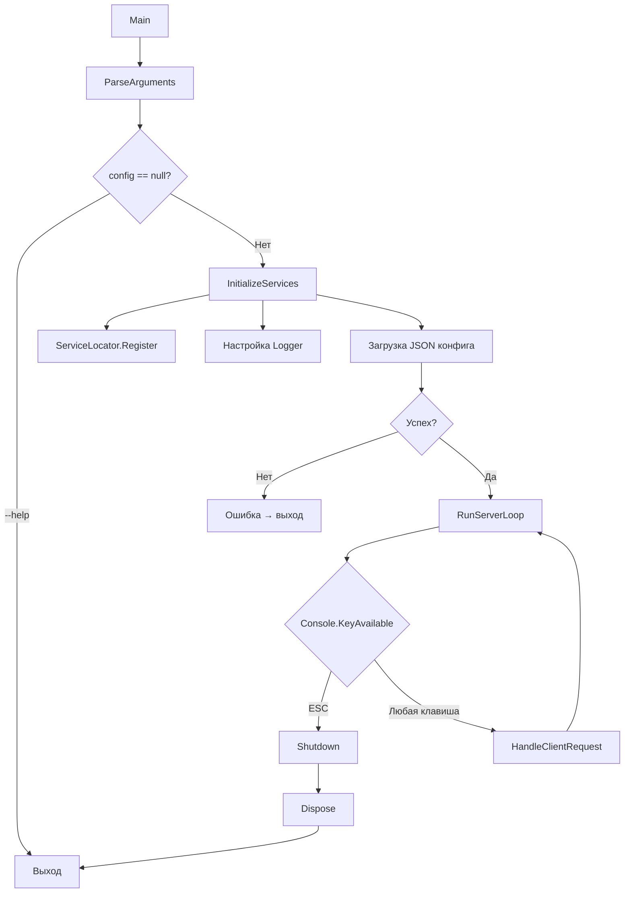
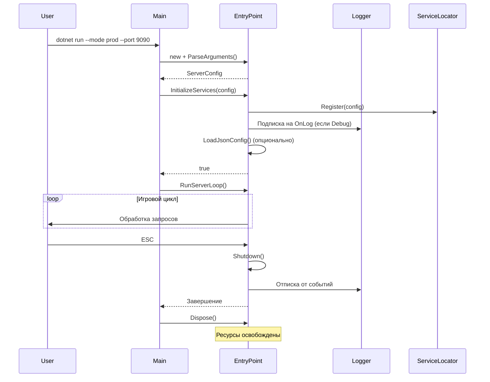

# 🚀 Game Server Entry Point

**Демонстрация правильной организации точки входа (Entry Point) в консольном игровом сервере на C#.**

Проект показывает, как должен выглядеть профессиональный запуск приложения: парсинг аргументов, инициализация сервисов, обработка ошибок, graceful shutdown и освобождение ресурсов.

---

## 🏗 Архитектура



### Схема жизненного цикла



---

## ✨ Возможности

| Функция | Описание |
|---------------|------------------------------------|
| Парсинг аргументов CLI | `--mode`, `--port`, `--debug`, `--config`, `--help` |
| Умные значения по умолчанию | Порт и debug зависят от режима (dev/test/prod) |
| Service Locator | Доступ к конфигурации из любого места |
| Событийное логирование | Делегаты и события для гибкой подписки |
| JSON конфигурация | Загрузка дополнительных параметров из файла |
| Graceful Shutdown | Корректное завершение по ESC |
| IDisposable + финализатор | Правильное освобождение ресурсов |
| Обработка ошибок | Try-catch на всех критических участках |

---

## 🚀 Запуск

### Базовый запуск (режим разработки)

```bash
dotnet run
```

```text
Режим: DEV
Порт: 7777
Debug: ВКЛ
```

### Продакшн режим

```bash
dotnet run -- --mode prod --port 8080 --debug false
```

### С пользовательской JSON конфигурацией

```bash
dotnet run -- --mode test --config server.json
```

### Показать справку

```bash
dotnet run -- --help
```

---

## 📝 Примеры использования

### server.json

```json
{
    "MaxPlayers": 250,
    "ServerName": "Epic RPG Server",
    "TickRate": 30.0
}
```

### Запуск с полной конфигурацией

```bash
dotnet run -- --mode prod --port 9000 --debug false --config server.json
```

### Вывод:

```text
=== ЗАПУСК СЕРВЕРА ===
Режим: PROD
Порт: 9000
Режим отладки: ВЫКЛ
Загружена конфигурация из server.json
   - Имя сервера: Epic RPG Server
   - Макс. игроков: 250
   - TickRate: 30
СЕРВЕР ЗАПУЩЕН на порту 9000
```

---

## 🔧 Расширение проекта

Проект спроектирован для легкого расширения. Вот несколько примеров:

### 1. Добавление нового аргумента командной строки

В ParseArguments добавь новый case:

```csharp
case "--max-players":
    if (i + 1 < args.Length && int.TryParse(args[i + 1], out int max))
    {
        config.MaxPlayers = max;
        i++;
    }
    break;
```

### 2. Добавление нового сервиса в Service Locator

```csharp
// В InitializeServices
ServiceLocator.Register(new DatabaseService(_config));

// В любом другом месте
var db = ServiceLocator.Get<DatabaseService>();
db.Connect();
```

### 3. Создание собственного обработчика логов

```csharp
// Подписка на событие Logger.OnLog
Logger.OnLog += message => 
{
    // Отправить логи в файл
    File.AppendAllText("server.log", message + Environment.NewLine);
    
    // Или в Telegram бота
    // TelegramBot.Send(message);
};
```

### 4. Замена синхронного цикла на асинхронный

```csharp
public async Task RunServerLoopAsync()
{
    while (_isRunning)
    {
        await HandleClientRequestAsync();
        await Task.Delay(10); // Вместо Thread.Sleep
    }
}
```

### 5. Поддержка разных типов конфигурации (XML, YAML)

```charp
private void LoadConfig(string path)
{
    var ext = Path.GetExtension(path);
    switch (ext)
    {
        case ".json": LoadJsonConfig(path); break;
        case ".xml": LoadXmlConfig(path); break;
        case ".yaml": LoadYamlConfig(path); break;
    }
}
```

---

## 🛠 Использованные технологии

| Технология | Применение |
|-------------------|-------------------------------------|
| .NET 6/7/8 | Платформа |
| System.Text.Json | Сериализация JSON конфига |
| System.Threading | Задержки и имитация работы |
| События и делегаты | Гибкая система логирования |
| Service Locator | Паттерн доступа к сервисам |
| IDisposable | Управление ресурсами |
| Обработка исключений | Стабильность работы |

---

## 📁 Структура проекта

```text
EntryPoint/
├── Program.cs                      # Точка входа (минималистичен)
└── Server/
    ├── GameServerEntryPoint.cs     # Основной класс (парсинг, инициализация, цикл)
    ├── ServerConfig.cs             # Модель конфигурации
    ├── Logger.cs                   # Логгер с событийной системой
    ├── ServiceLocator.cs           # DI контейнер (упрощенный)
    └── README.md                   # Этот файл
```

---

## 👨‍💻 Автор

Vladimir Vaize | [GitHub](https://github.com/VladimirVaize) | [Telegram Channel](https://t.me/rigelstudio_gamedev)

---

### ⭐ Если этот проект был полезен, поставьте звезду на GitHub!


